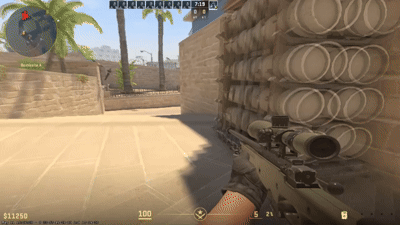
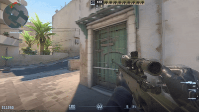
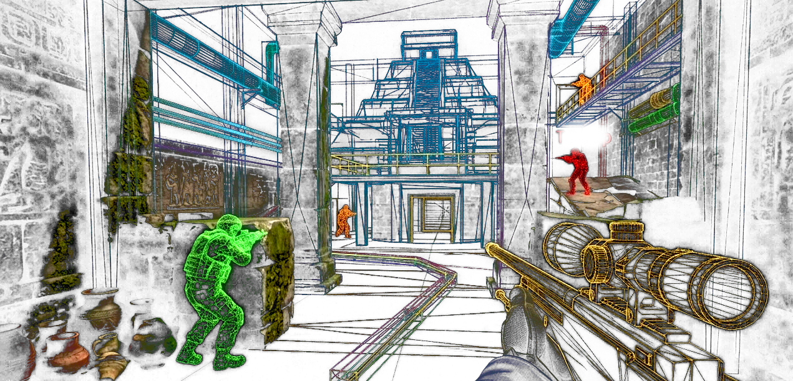

<div align="center">


  
# CS2 AntiWallHack

### A Counter-Strike 2 AntiWallHack metamod plugin.

**It does not detect cheats, issue bans or replace a complete anti-cheat system.**

[](#features)
[](https://github.com/swiftly-solution/swiftlys2)
[](LICENSE)
[](https://buymeacoffee.com/cs4fun)

This AC feature is taken from [CS2 AntiCheat Defense](https://github.com/ZusDev/CS2-Anticheat-Defense)
</div>

## Showcase

<table>
<tr>
<td width="50%" align="center">
<br>
<strong>Showcase on Mirage</strong>
</td>
<td width="50%" align="center">
<br>
<strong>Showcase on Dust2</strong>
</td>
</tr>
</table>

### A wallhack cannot render player data that has not been transmitted by the server.

AntiWallHack aims to reduce the enemy information available to wallhacks. When an enemy is completely hidden behind solid cover, the plugin can stop sending that enemy and their equipment to a player's game client. Once a visibility check finds a clear path, normal transmission is allowed again.

</div>

---

> [!NOTE]
> Teammates, dead or spectator viewers, warmup, freeze time and ended rounds are not filtered. Bots can be enemy targets, but the plugin does not filter what bot viewers receive. Enemies outside the selected nearest group are left untouched.

## Requirements

[](https://www.sourcemm.net)

## Features

- **Checks solid cover** using the game's line-tracing API.
- **Anticipates movement** to help reduce sudden appearances around corners.
- **Keeps recently visible enemies available briefly** to reduce flickering.

## How it works

For each player, the plugin selects the nearest enemies, up to the configured count. It then follows this process:

1. **Nearby enemies stay available.** Enemies within `AlwaysVisibleDistance` bypass wall checks.
2. **Check for a clear path.** Rays run from the viewer's eyes to several points around each selected enemy.
3. **Check ahead when moving.** Additional rays use estimated future positions based on current movement speed and direction.
4. **Keep visible enemies available.** One clear or uncertain result is enough to allow normal transmission.
5. **Hide fully blocked enemies.** If every tested path is blocked and the grace period has expired, the plugin withholds that enemy and their collected equipment from that viewer.



## Installation

1. Get the packaged .
2. Extract to your server's `game/csgo/addons` directory.
3. Restart the server.


## Configuration

```text
game/csgo/cfg/AntiWallHack.cfg
```

The included config.jsonc contains:

```
// AntiWallHack configuration.

Enabled                      1       // Enable visibility filtering.
NearestEnemies               5       // Number of enemies checked.
VisibleGraceTicks            20      // Visibility grace period.
BoundsPadding                48      // Extra bounds padding.
PredictionSeconds            0.2     // Movement prediction.
AlwaysVisibleDistance        160     // Reveal nearby enemies.
SetDontTransmitToZero        1       // Set sv_enable_donttransmit to 0.
```

| Setting | Value | What it does |
| :--- | :---: | :--- |
| `Enabled` | `1` | Turns visibility filtering on or off. |
| `NearestEnemies` | `5` | Number of nearest enemies checked for each viewer. |
| `VisibleGraceTicks` | `20` | How long an enemy stays available after a clear check. |
| `BoundsPadding` | `48` | Helping reveal corner peeks earlier. Measured in game units. |
| `PredictionSeconds` | `0.2` | How far ahead to estimate moving players' positions. `0.2` means 200 ms. |
| `AlwaysVisibleDistance` | `120` | Nearby enemies within this radius bypass wall checks, including through walls. Measured in game units. |
| `SetDontTransmitToZero` | `1` | Automatically requests the optional transmission compatibility setting when the server exposes it. |

## Build
```
python -m pip install git+https://github.com/alliedmodders/ambuild
python native/setup.py
mkdir native\obj
cd native\obj
python ../configure.py --sdks=cs2 --targets=x86_64 --enable-optimize --mms_path=../deps/metamod-source --hl2sdk-root=../deps --hl2sdk-manifests=../deps/metamod-source/hl2sdk-manifests
ambuild
```

### Adjusting corner pop-in

Larger `BoundsPadding` and `PredictionSeconds` values can make enemies available earlier. A longer `VisibleGraceTicks` period delays hiding them again. These settings trade stricter hiding for smoother appearances and prediction is an estimate not a guarantee.

Increasing `AlwaysVisibleDistance` also reveals nearby enemies earlier, but allows them through walls within that radius.

## Performance

Ray tracing is the main workload. Open paths can finish after one ray; fully blocked enemies can need all 12 sample rays, plus another 12 for predicted positions when players move.

The plugin reuses visibility decisions within the same tick. If the shared trace budget runs out, it leaves affected enemies available instead of hiding them without a completed check. A smaller budget can reduce trace work but also reduce filtering coverage.

## FAQ

### Does this stop every wallhack?

No. It limits transmission of selected hidden enemies and their equipment. It does not filter sound, radar messages or all other information a cheat might use.

### Does smoke hide enemies from transmission?

No. Smoke is not part of the plugin's visibility checks. Window collision layers are also excluded from the ray filter.

### Why can I still see a nearby enemy through a wall with a cheat?

Enemies inside `AlwaysVisibleDistance` bypass ray checks. Other reasons include the grace period, an exhausted trace budget, or the enemy being outside the nearest group selected for checking.
